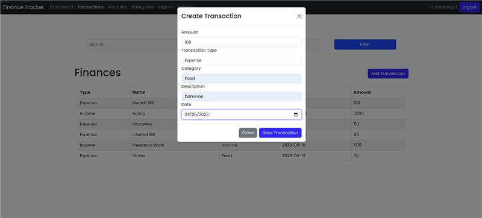
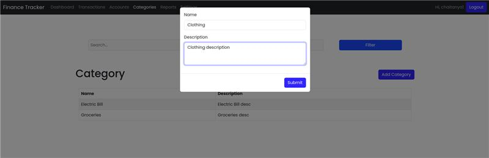
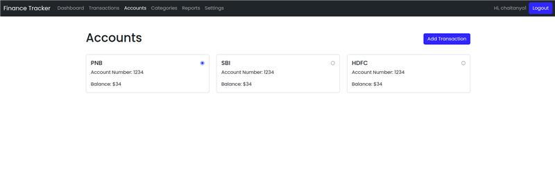
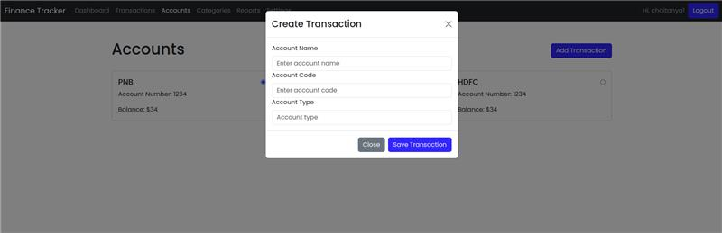
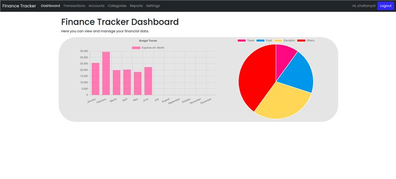

# Landing Page

A visually appealing landing page that provides a brief overview of the project and links to the other pages.

# Login Page
A login page that allows users to login to the application

# Signup Page 
If users don't have an account they can click on the "Sign Up" button to be redirected to the sign up page.

# Dashboard Page

Dashboard page that provides a brief overview of the user's financial status. It includes a graph that shows the user's net worth over time, a list of the user's accounts, and a list of the user's transactions.

# Transactions Page
Transactions Page that allows users to view, add, edit, and delete transactions. It also allows users to filter transactions by date, category, and account.

# Categories Page
Categoroes Page that allows users to view, add, edit, and delete categories.

# Accounts Page
Accounts Page that allows users to view, add, edit, and delete accounts.

# Reports Page
Reports Page that allows users to view reports of their income and expenses over time.

