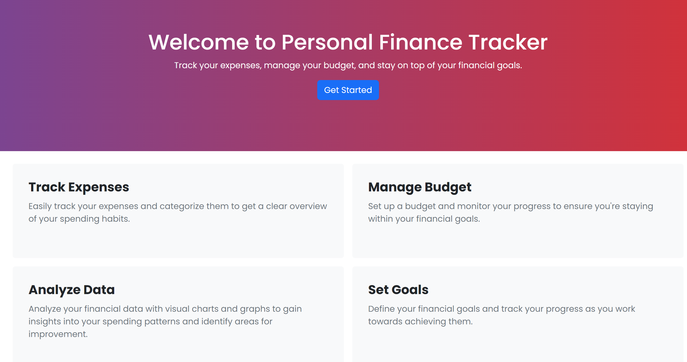
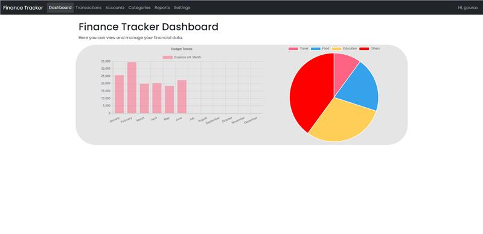

# Personal Finance Tracker User Guide

Welcome to the Personal Finance Tracker user guide! This guide will walk you through the various features and functionalities of the application, helping you manage your income, expenses, categories, and accounts effectively.

## Features
Following are the key features of the Personal Finance Tracker application:
- Easy and intutive user interface for add and managing expenses and income transactions
- Define categories for transactions as per your needs - for example, you can create categories like "Food", "Travel", "Salary", etc.
- Create accounts to track your balance and transactions - for example, you can create accounts like "Cash", "Credit Card", "Bank Account", etc.
- Generate reports to get insights into your spending patterns and income sources
- Manage your profile and settings
- Secure login and registration
- Responsive design for mobile and desktop devices
- Multi-Tenant support - you can create multiple families and family memmbers can manage their own customized transactions, categories, and accounts etc.

## Sections

Personal Finance Tracker is divided into the following sections:

1. [Dashboard](#dashboard)
2. [Transactions](#transactions)
3. [Categories](#categories)
4. [Accounts](#accounts)
5. [Reports](#reports)
6. [Settings](#settings)

## Dashboard

The dashboard provides an overview of your financial information. It displays your current balance, income, expenses, and may include charts or graphs representing your spending patterns. Use the dashboard to get a quick snapshot of your financial situation.

## Transactions

The transactions feature allows you to add, edit, and delete income and expense entries. You can categorize each transaction to keep track of your spending habits and income sources. Here's how you can use the transactions feature:

1. **View Transactions:** Navigate to the Transactions page to see a list of all your transactions, including their descriptions, amounts, and types (income or expense).
2. **Add Transaction:** Click on the "Add Transaction" button to create a new income or expense entry. Enter the necessary details, such as description, amount, and category.
3. **Edit Transaction:** To modify an existing transaction, click on the edit icon or the transaction itself. Update the necessary fields and save the changes.
4. **Delete Transaction:** If you want to remove a transaction, locate the delete icon next to the transaction and confirm the deletion.

## Categories

The categories feature allows you to manage and organize your transaction categories. You can create, edit, and delete categories to classify your income and expenses. Follow these steps to work with categories:

1. **View Categories:** Access the Categories page to see a list of all your categories, along with their names and parent categories (if applicable).
2. **Add Category:** Click on the "Add Category" button to create a new category. Provide a name for the category and, if needed, select a parent category to create a hierarchy.
3. **Edit Category:** To modify a category, locate the edit icon or the category itself. Update the name or parent category as required and save the changes.
4. **Delete Category:** If you want to remove a category, find the delete icon next to the category and confirm the deletion. Note that deleting a category may affect associated transactions.

## Accounts

The accounts feature enables you to manage your financial accounts, such as bank accounts, credit cards, or cash. You can add, edit, and delete accounts, as well as track transactions associated with each account. Here's how to work with accounts:

1. **View Accounts:** Go to the Accounts page to see a list of all your accounts, including their names, current balances, and currencies.
2. **Add Account:** Click on the "Add Account" button to create a new account. Enter a name for the account, specify the initial balance, and select the currency.
3. **Edit Account:** To modify an existing account, locate the edit icon or the account itself. Update the name, balance, or currency as necessary and save the changes.
4. **Delete Account:** If you want to remove an account, find the delete icon next to the account and confirm the deletion. Note that deleting an account may affect associated transactions.

## Reports

The reports feature allows you to generate various reports related to your financial data. You can generate expense reports, income reports, category-wise spending reports, and more. Follow these steps to generate reports:

1. **Select Report Type:** Navigate to the Reports page and choose the type of report you want to generate, such as expense report or income report.
2. **Set Filters (Optional):** If needed, set filters to refine the report results. For example, you can specify a date range or select specific categories.
3. **Generate Report:** Click on the "Generate Report" button to generate the report based on your selections.
4. **View and Export:** Once the report is generated, you can view it on the screen and, if desired, export it to a file format like PDF or CSV.

## Settings

The settings feature allows you to manage your account settings and preferences. You can update your profile information, change passwords, and modify notification preferences. Follow these steps to access and modify your settings:

1. **Access Settings:** Click on the "Settings" option in the menu to navigate to the Settings page.
2. **Update Profile:** Update your profile information, such as username and email address, if necessary.
3. **Change Password:** If you want to change your password, locate the "Change Password" section and follow the instructions to set a new password.
4. **Notification Preferences:** Modify your notification preferences, such as email notifications or app notifications, based on your preferences.

Congratulations! You are now familiar with the various features of the Personal Finance Tracker application. Start managing your income, expenses, categories, and accounts efficiently to take control of your finances!

## Following features are planned for future releases
- Offline support
- PWA support
- Dark mode
- Multi-language support
- Multi-currency support

If you have any further questions or need assistance, please reach out to our [development team](./README.md#development-team).

Enjoy using the Personal Finance Tracker!

